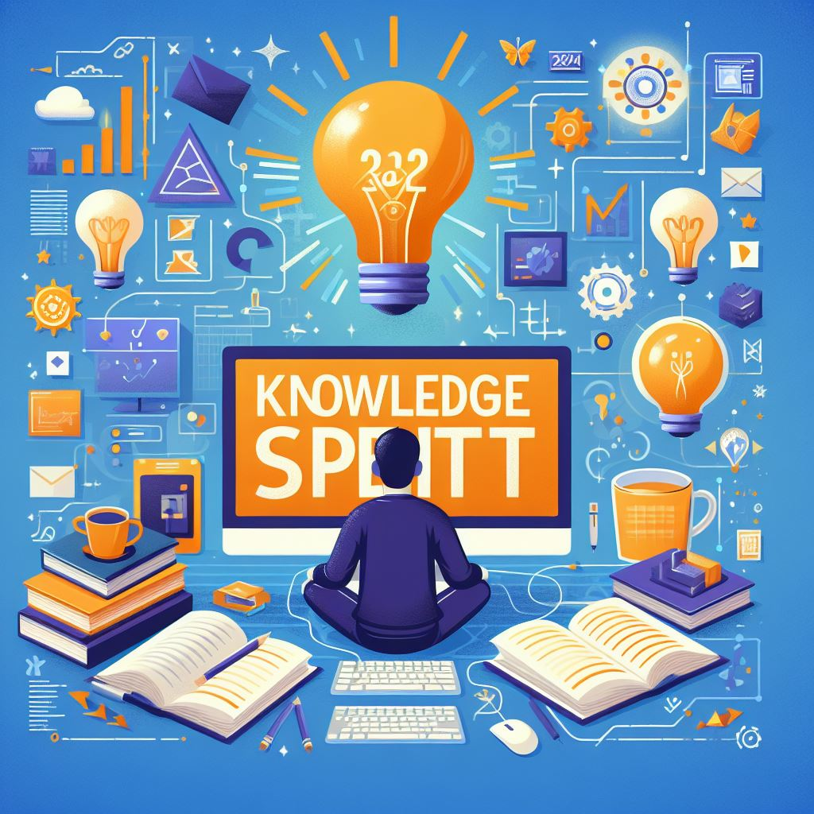

    

# **Sprint de Conhecimento: Defina e Realize Metas de Aprendizado em Programação para 2024** 🚀💻

## **Introdução:**
O ano de 2024 está à porta, e para os entusiastas e profissionais da programação, isso significa uma nova oportunidade para aprimorar habilidades e conquistar novos horizontes no vasto campo da tecnologia. Neste artigo, exploraremos a importância de estabelecer metas de aprendizado específicas em programação para o próximo ano e como realizar uma verdadeira "sprint de conhecimento".

## **Definindo Suas Metas:**
O primeiro passo crucial para uma sprint de conhecimento bem-sucedida é a definição clara e objetiva de metas. Considere o que deseja alcançar em termos de linguagens de programação, frameworks, ou mesmo áreas especializadas, como inteligência artificial, desenvolvimento web ou segurança da informação. Seja realista, mas também desafiador. Suas metas devem inspirar motivação e esforço constante.

## **Metas Mensuráveis:**
Metas vagas dificilmente levam ao sucesso. Ao estabelecer suas metas de aprendizado, torne-as mensuráveis. Por exemplo, ao invés de simplesmente dizer "aprender Python", defina a meta de "desenvolver um projeto completo em Python até o final de março". Isso não apenas torna sua jornada mais tangível, mas também permite que avalie seu progresso de maneira mais eficaz.

## **Planejamento Estratégico:**
Uma sprint bem-sucedida requer um planejamento estratégico. Divida suas metas em etapas menores, criando um cronograma realista. Seja detalhado e aloque tempo suficiente para a prática e a aplicação prática do que está aprendendo. O planejamento estratégico não só evita a sensação de sobrecarga, mas também proporciona um senso de conquista à medida que você completa cada etapa.

## **Recursos e Apoio Comunitário:**
Em um mundo digital interconectado, há uma abundância de recursos disponíveis para aprendizado em programação. Aproveite tutoriais online, cursos especializados, documentações e fóruns. Além disso, engaje-se em comunidades de programadores para trocar experiências, obter feedback e compartilhar conhecimento. O apoio de uma comunidade pode ser um impulsionador significativo para alcançar suas metas.

## **Adaptabilidade e Aprendizado Contínuo:**
O campo da programação está em constante evolução. À medida que define e trabalha para alcançar suas metas em 2024, esteja preparado para ajustar e adaptar seu plano de aprendizado conforme necessário. Esteja aberto a novas tecnologias, metodologias e desafios. A aprendizagem contínua é uma característica fundamental dos programadores de sucesso.

## **Conclusão:**
Em conclusão, a "Sprint de Conhecimento" para 2024 é uma jornada emocionante que promete crescimento pessoal e profissional. Ao definir metas específicas, mensuráveis e realizáveis, criar um plano estratégico, aproveitar recursos disponíveis e se envolver com a comunidade, você estará no caminho certo para alcançar novos patamares em suas habilidades de programação. Então, prepare-se para uma incrível jornada de aprendizado em 2024, e que cada linha de código que você escreva seja um passo em direção a um futuro mais brilhante e tecnologicamente avançado. 🌐✨

## 💻 Tecnologias utilizadas no projeto

- [ChatGPT](https://chat.openai.com/) - para título, conteúdo e formatação
- [Bing](https://www.bing.com/images/create) - Para gerar imagem
- [Dio](https://web.dio.me/home) - Para direcionar o projeto

### Esse conteúdo foi gerado por IA, mas foi revisado por humano!

## Curtiu? então compartilhe!